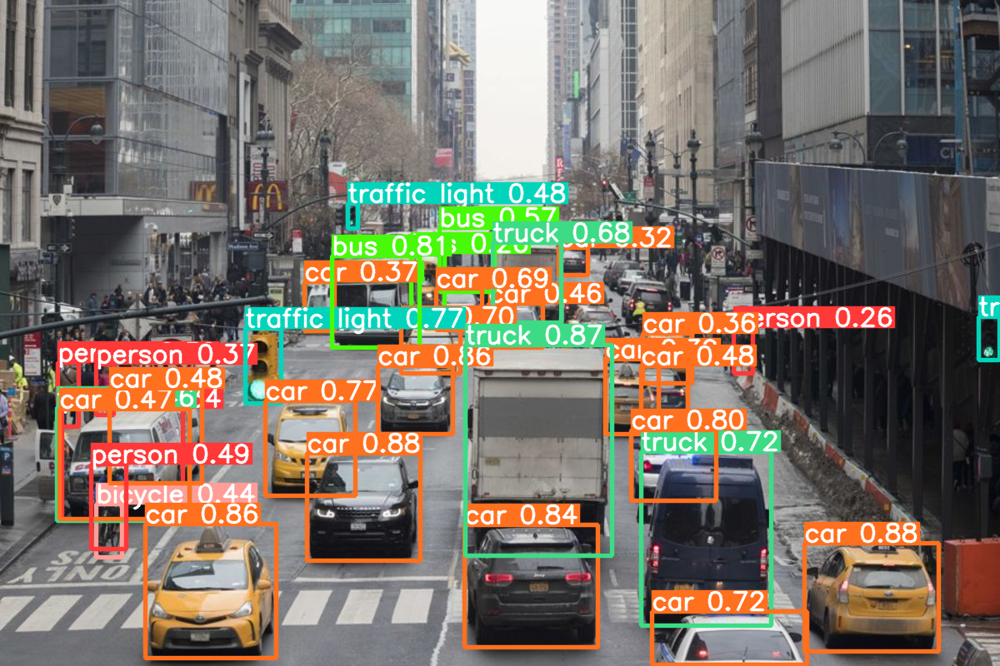
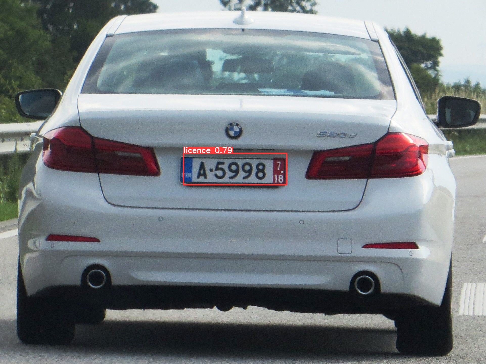

# YOLOv5

Here I check YOLO model on images, then train on my custom object detection model based on yolo.

check dataset from this [link](https://www.kaggle.com/andrewmvd/car-plate-detection)

## Original YOLOv5 results

## custom YOLOv5 results

